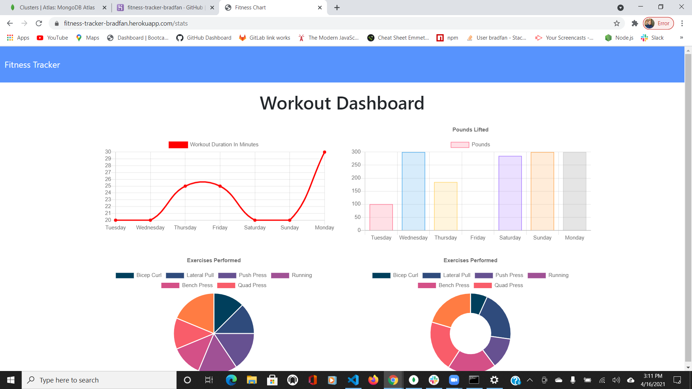

# Fitness Tracker

Heroku Deployed Link: https://fitness-tracker-bradfan.herokuapp.com/?id=607a0a9ca6f9f702735cf4f0

Github Repo Link: https://github.com/bradfan/fitness-tracker

This application is designed to help the user track their exercise routines. When the user loads the page, they are given the option to create a new workout or continue with their last workout. The user is able to add exercises to the most recent workout plan and/or add new exercises to a new workout plan.They can view the combined weight of multiple exercises from the past seven workouts on the stats page as well as view the total duration of each workout from the past seven workouts on the stats page.

